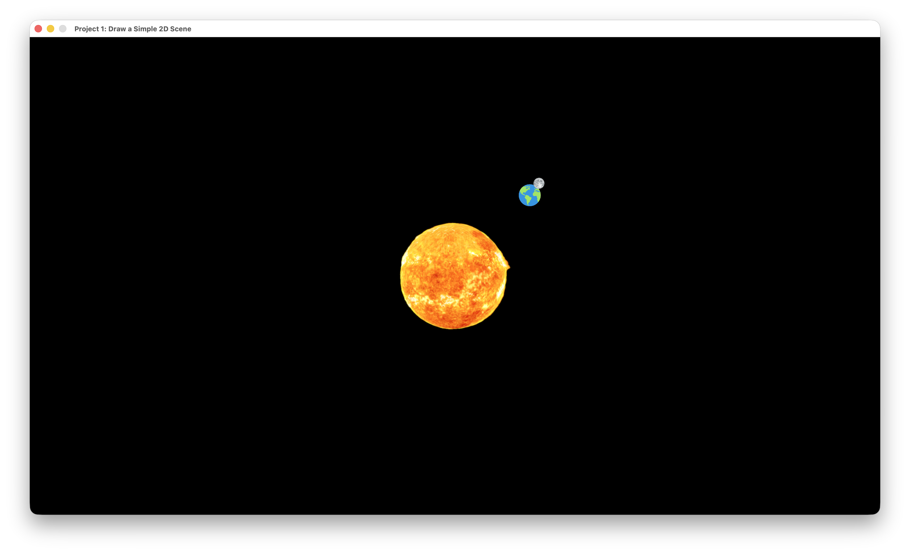
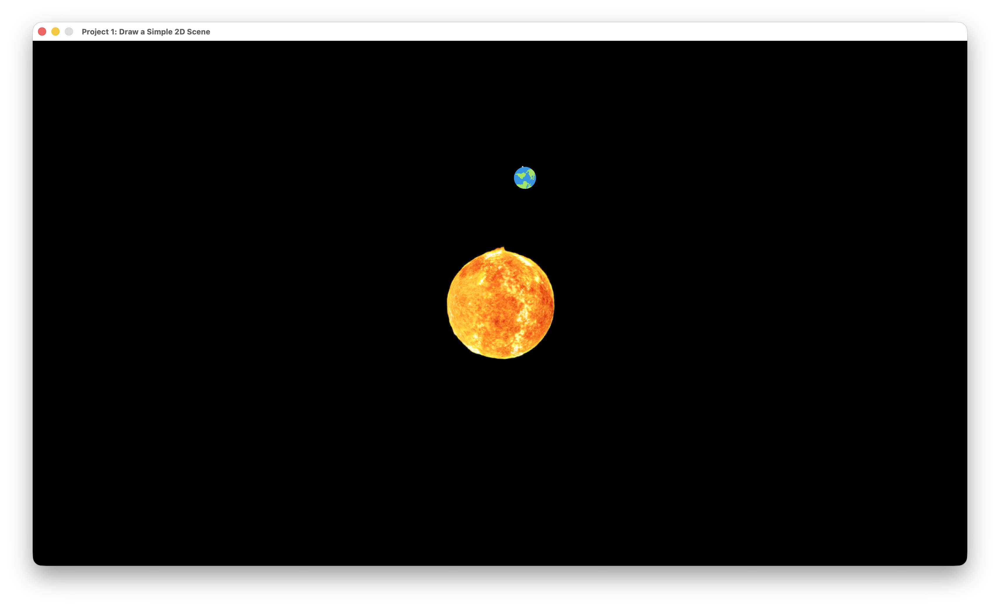
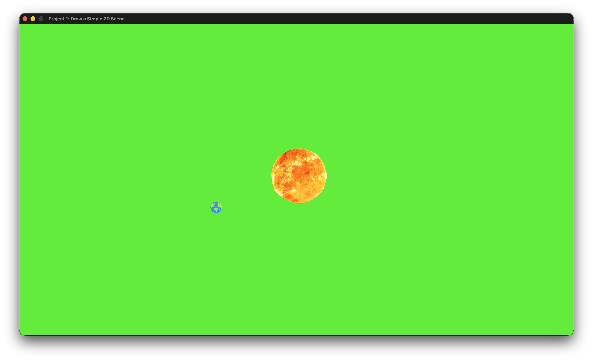

# Project 1 - Simple 2D Scene

A small raylib project that simulates a simplified three-body system for CS-3113 Project 1. The sun, earth, and moon use sprite sheet UVs from `assets/merged_texture.png` and move according to a handcrafted gravitational model while satisfying the assignment requirements for unique textures, relative motion, and non-linear movement.

See [instructions.md](Instruction.md) for more details.

## Features
- Simulates sun, earth, and moon with individual masses, velocities, and accelerations
- Applies gravitational attraction pairwise to keep bodies in motion and avoid linear paths
- Optional scale and rotation effects tied to the force vectors (toggleable via hardcoded flags)
- Supports an optional flashing background for extra credit exploration.
**WARNING:** The flashing background effect produces rapid color changes. DO NOT ENABLE THIS IF YOU HAVE SENSITIVITY.

# How this project implemented
1. Create a class for drawing textures (GameObject)
    - uv_top_left
    - texture_size
    - origin
    - px_position
    - scale
    - angle
    - tint
2 inherted from GameObject class, create a planet class, contain:
    - mass
    - velocity
    - acceleration
    - applyForce
    - update
3. Initialize the planets and set their initial positions, velocities, and scales
4. On Update, calculate the gravitational force for each planet and apply it to the planet
    - Calculated each planet's gravitational force by summing the gravitational forces from all other planets
    - apply delta time to the planet's velocity and position, reset acceleration after each update
5. On Render, draw the planets in the order of sun -> earth -> moon
    - Draw the planet using planet -> gameObject -> draw()
    - Check FLAGS to see if any optional effects are enabled
        - If flashing background is enabled, flash the background randomly
        - If scale-based sizing is enabled, calculate the scale factor based on the gravitational force
        - If rotation is enabled, calculate the angle based on the gravitational force
6. End the program if the window is closed

## Technical Details
```cpp
class GameObject {
    public:
        Vector2 uv_top_left;
        Vector2 texture_size;
        Vector2 origin;
        Vector2 px_position;
```
```cpp
// Refer to lectures/03-textures/README.md for more details
// Contain whole process of 
// 1. Determine the texture area
// 2. Determine the destination area
// 3. Determine the origin inside the destination area
// 4. Draw the texture
void drawTexture(Vector2 uv_top_left, Vector2 texture_size, Vector2 origin, Vector2 px_position, float scale, float angle, Color tint);
```
```cpp
class planet : public GameObject {
    public:
        float mass;
        Vector2 velocity;
        Vector2 acceleration;
```
```cpp
Vector2 calculateGravitationalForce(const planet& p1, const planet& p2);
```

## Build & Run (Only tested on macOS)
1. Install raylib (https://www.raylib.com/) via Homebrew: `brew install raylib` (See [SET_UP.md](resources/SET_UP.md) for more details)
2. Build the project: `make`
3. Execute the binary: `make run`

## Key Configuration Flags
Adjust the options near the top of `main.cpp` to experiment with different visual effects:
```cpp
constexpr bool APPLY_SCALE_FACTOR_TO_PLANET_BASED_ON_GRAVITY = true;
constexpr bool APPLY_ROTATION_TO_PLANET_BASED_ON_GRAVITY_ANGLE = false;
constexpr bool ENABLE_FLASHING_BACKGROUND = false;
```

# Grading Criteria
- [x] You must use **delta time** in your animations.
- [x] You should submit your homework on **Brightspace**.
- [x] You should also push the same version to your **GitHub account**.
    * Any commits after the deadline will be ignored.
- [x] Just submit your **GitHub link** with all your files within your project.
- [x] Do **not** use any `raylib` functionality that we have not learned in class.
- [x] Required Header in `main.cpp`

* At Least Three Objects (25%)

- [x] At least three different "objects" in the scene.
- [x] Each object must use a different texture.
- [x] Textures must not be solid colors, but actual images.
    * You may use any images you like that were not used in class.

* Requirement 2: Relative Position (10%)
- [?] At least one object must transform in relation to another object.
// Explain:
   - This is not satisfied because the planets are not transforming in relation to another object. In fact, their positions are all relative to alll objects. Due to gravity forces, their positions are dynamic calculated on each update.

* Requirement 3: Movement (65%)

- [x] Every object must translate in a pattern **other than** just up/down or left/right.
- [x] Each object must translate in a slightly different pattern.
// Explain:
   - This is satisfied because no planets are moving in same trajectory.
   - Even if small difference in initial velocity, they will eventually diverge due to gravity forces. (Chaotic System)
    * You may use orbiting (from the first classwork project) as one pattern.
- [x] At least one object must rotate.
// Explain:
   - This is satisfied because you can enable rotation via flag.
- [x] At least one object must scale.
// Explain:
   - This is satisfied because you can enable scaling via flag.


* Extra Credit

- [x] Have the game’s background color also change in some kind of pattern.
// Explain:
   - This is satisfied because you can enable flashing background via flag. Although not recommended, it is still a valid option.


## Screenshots
Base simulation with only gravitational attraction enabled (no optional visual extras):


Scaled and angled planet responses showcase how the optional modifiers change the orbital feel:


All toggles enabled, including scale-based sizing, rotation, and the flashing background effect:


