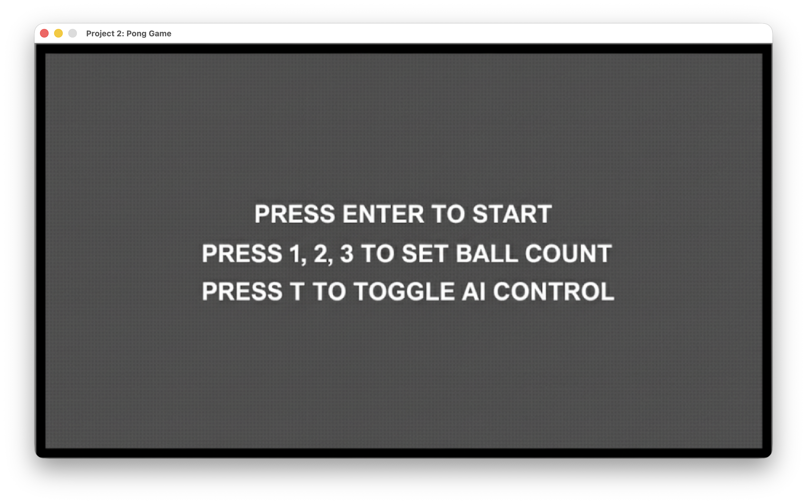
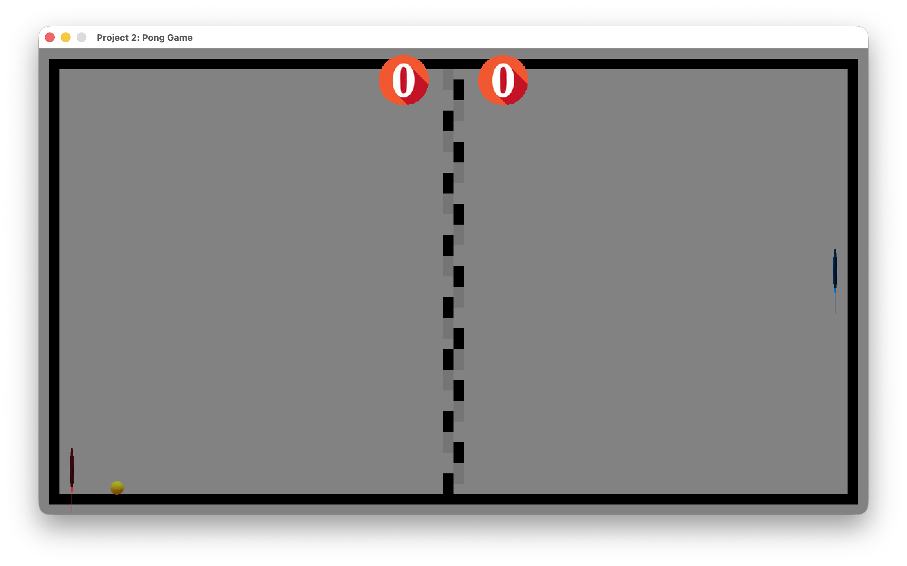
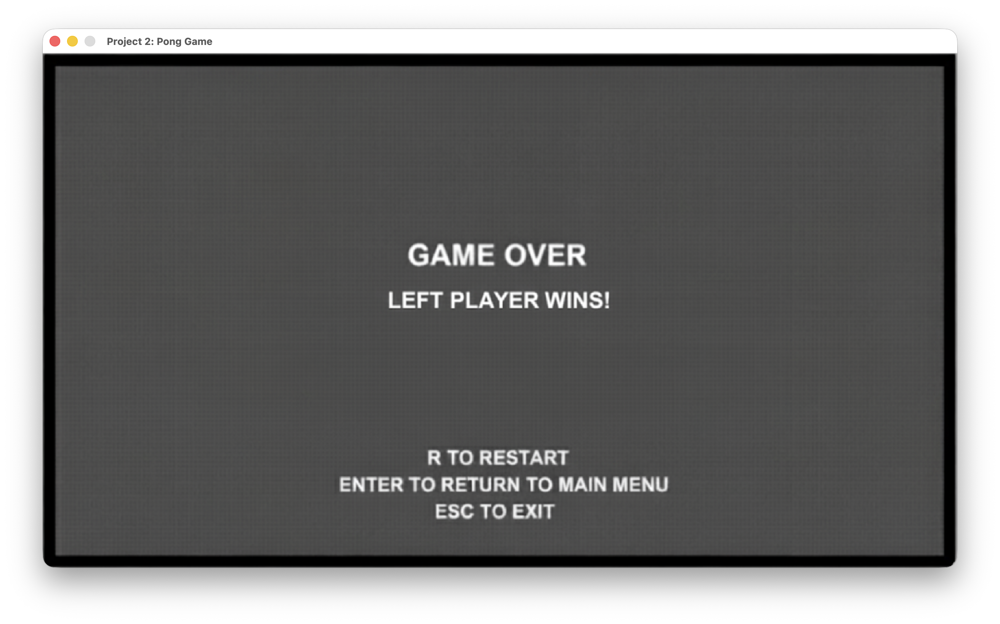

## Project 2 - Pong Clone Latest

[instruction](instruction.md)

A Raylib-based Pong recreation for CS-3113 Project 2 that satisfies the assignment requirements for textured visuals, dual-player controls, a single-player toggle, multi-ball management capped at three, and a definitive game-over state. Assets are sourced from the `assets/` pipeline, and gameplay runs entirely on delta-time-driven physics.

See `instruction.md` for the original rubric and grading guidelines.

## Features

- Textured paddles, balls, scoreboard, and start/game-over screens rendered via Raylib.
- Supports two-player keyboard play or a toggleable AI paddle with multiple difficulty modes.
- Real-time ball count adjustment via number keys `1`–`3`, with safeguards against exceeding three active balls.
- Game state flow covering Start → In Game → Game Over, with score tracking and restart options.
- Physics helpers for wind resistance, ground friction, and collision rollback to keep motion stable at variable frame rates.

## How This Project Was Implemented

- Define a shared `GameObject` class that stores transform/physics state and draws textured quads with `DrawTexturePro`.
  - Members: `position`, `velocity`, `acceleration`, `collisionBox`, `mass`, `scale`, `angle`, `speed`, `color`, `texture`.
- Derive `Ball` from `GameObject` to add collision handling, randomized resets, and goal detection that transitions the game into the GAME_OVER state.
- Derive `Paddle` from `GameObject` to clamp movement inside the playfield and expose reset helpers.
- Track game state (`START`, `IN_GAME`, `GAME_OVER`) and per-frame delta time to drive updates.
- Maintain dynamic arrays of balls and paddles; respond to input to switch control modes, change ball counts, and reset scores.
- Render background, paddles, balls, scoreboards, and UI textures according to the active game state.

## Technical Details

```cpp
class GameObject {
public:
    Vector2 position;
    Vector2 velocity;
    Vector2 acceleration;
    Vector2 collisionBox;
    float mass;
    Vector2 scale;
    float angle;
    float speed;
    Color color;
    Texture2D* texture;

    void draw();                    // Wraps DrawTexturePro with origin-centered quads
    void update(float deltaTime);    // Applies acceleration → velocity → position using delta time
    void applyForce(Vector2 force);  // Accumulates forces before the next update
    bool collidedScreenVertical();   // Detects top/bottom wall intersection
    bool collidedScreenHorizontal(); // Detects left/right wall intersection
};

class Ball : public GameObject {
public:
    void reset();                    // Randomizes spawn position, angle, and speed
    void handlePaddleCollision(GameObject* paddle);
    void handleWallCollisions();
    void update(float deltaTime);    // Increments score and triggers GAME_OVER on goals
};

class Paddle : public GameObject {
public:
    void handleVerticalCollision();  // Constrains paddle inside the court
    void reset();
};

bool isCollidingBox(GameObject* a, GameObject* b); // Axis-aligned overlap test
```

## Build & Run (Tested on macOS)

1. Install Raylib (`brew install raylib`) or follow the course setup instructions for your OS.
2. Ensure a C++17-capable compiler and `pkg-config` are available.
3. Build the project from this folder:
   ```bash
   make
   ```
4. Launch the game:
   ```bash
   make run
   ```
5. Use `make clean` to remove compiled artefacts.

## Key Configuration Flags (in `main.cpp`)

- `constexpr bool ENABLE_WIND_RESISTANCE = true;`
- `constexpr bool ENABLE_GROUND_FRICTION = true;`
- `constexpr bool APPLY_RANDOM_FORCE_ON_COLLISION = true;`
- `constexpr int GAME_TARGET_GAME_OVER_SCORE = 1;`
- `constexpr int HARD_BALL_COUNT_CAP = 3;`
- `constexpr float AI_CONTROLLED_IGNORE_DISTANCE = 50;`

Toggle or tune these constants to explore alternate physics or AI behaviours while keeping the assignment constraints in place.

## Grading Criteria Alignment

- **Delta time**: All motion and physics integrate with `deltaTime` inside `updateDeltaTime()` and per-object updates.
- **Submission rules**: Repository is structured for GitHub submission with textures stored in `assets/`.
- **No unapproved APIs**: Uses Raylib calls covered in class (window, textures, input, drawing).
- **Header block**: `main.cpp` includes the specified academic honesty statement with the correct due date.
- **Requirement 1**: Two textured paddles, textured balls, independent movement, wall clamping, and bounce responses implemented.
- **Requirement 2**: `T` toggles AI control for the right paddle; manual inputs are ignored while AI presets (`T`, `Y`, `U`) are active.
- **Requirement 3**: Number keys `1`–`3` set the ball count, and helper logic prevents exceeding three simultaneous balls.
- **Requirement 4**: When a ball exits a goal line, scores update and the game transitions into `GAME_OVER`, pausing play until restart.

## Screenshots

**Game Start**

**In Game**

**Game Over**

