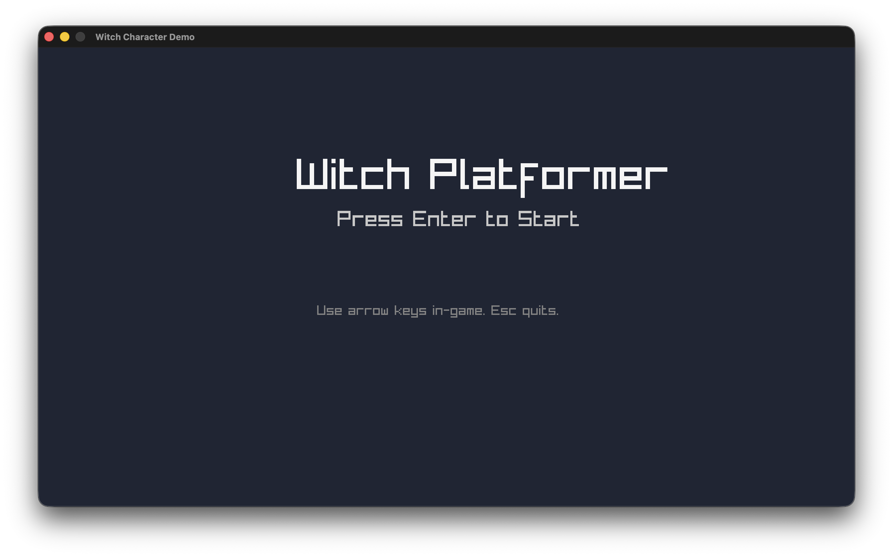
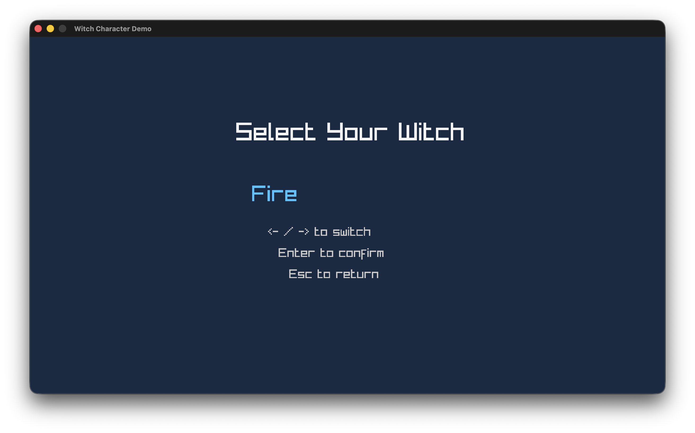
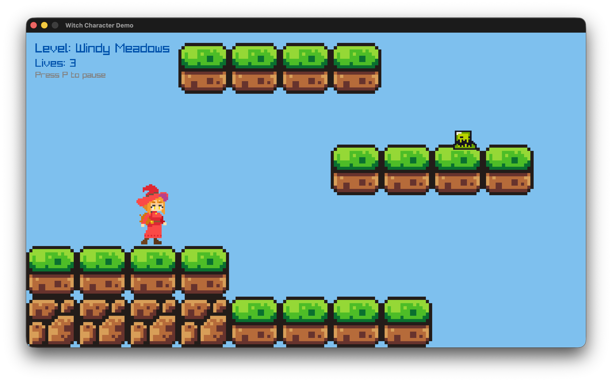
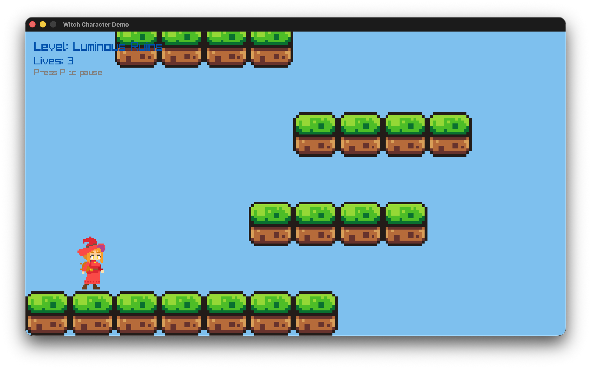
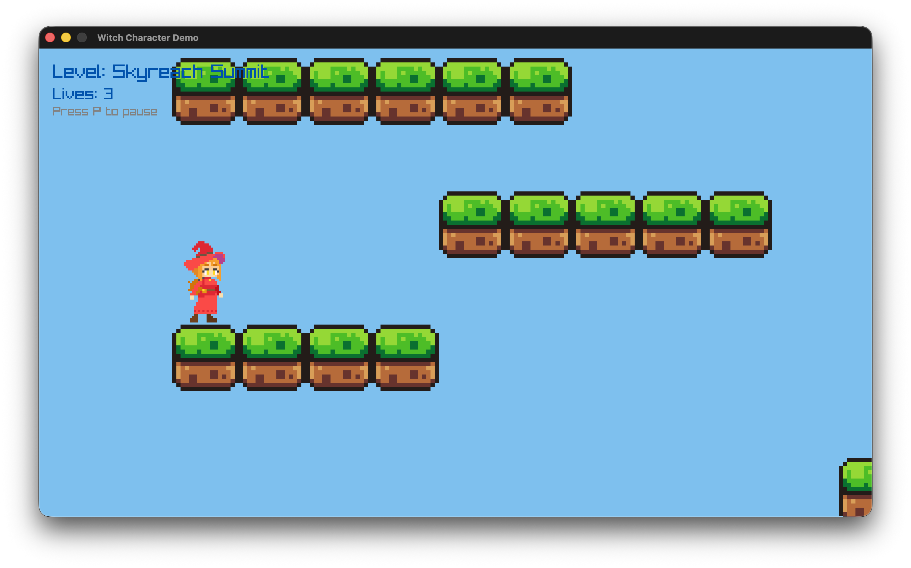
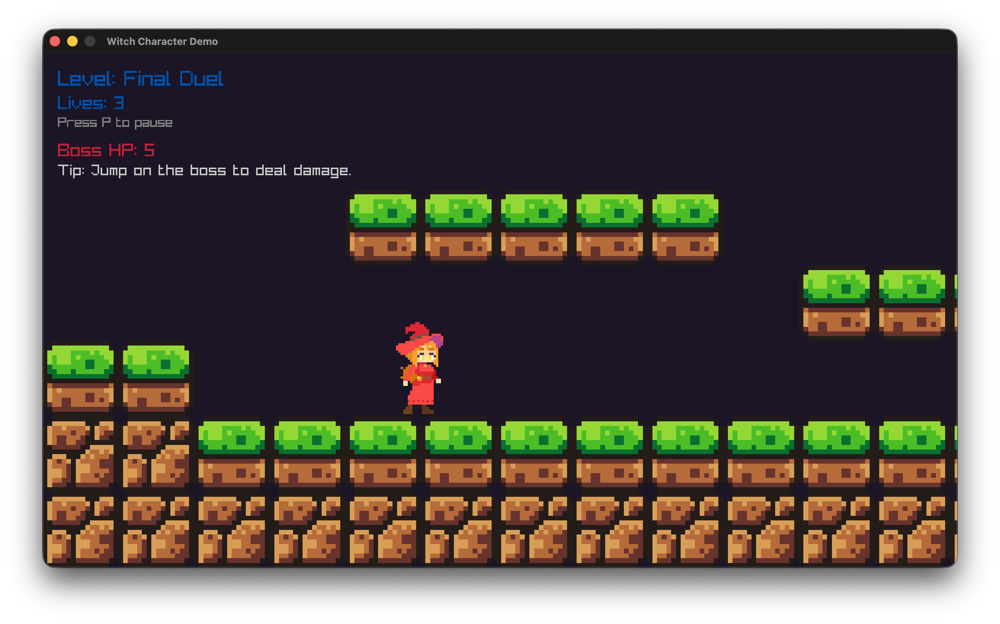
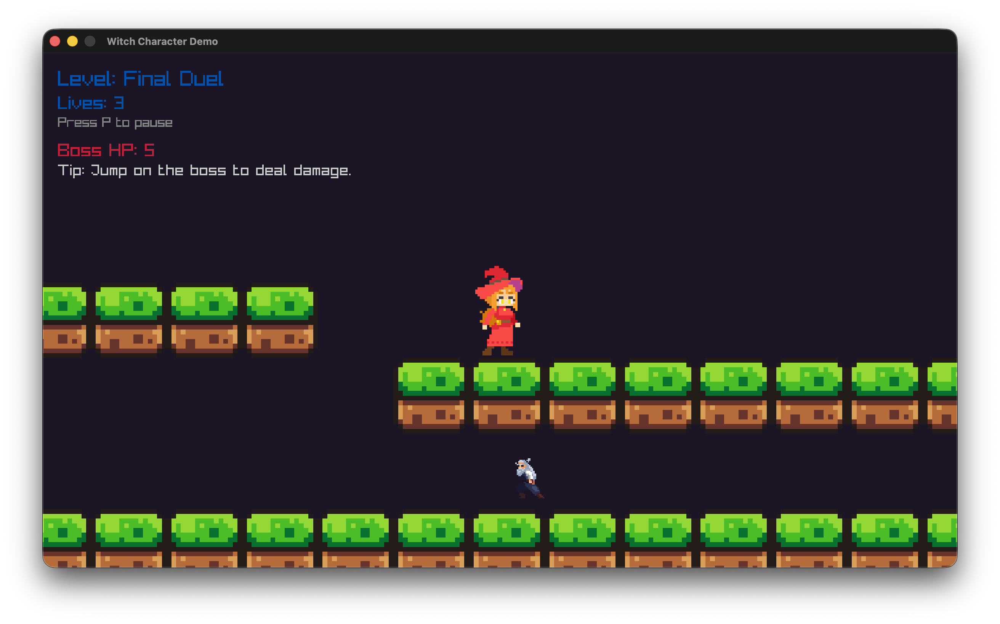
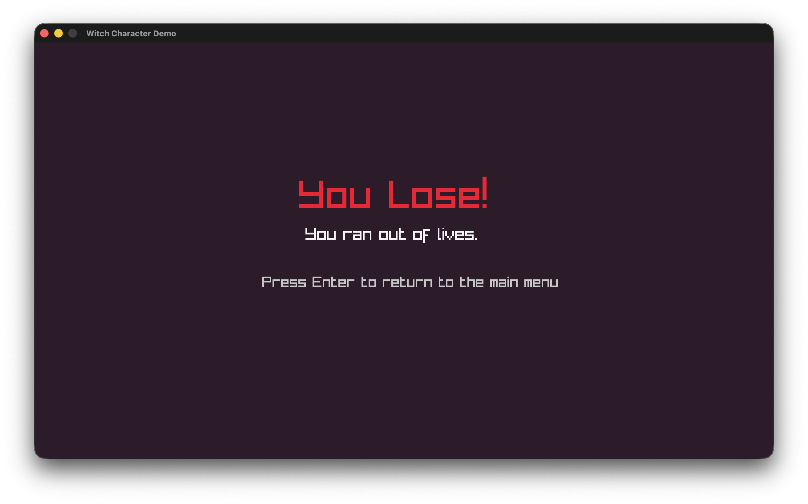

# Project 4 – Rise of the AI

[instruction](instruction.md)

A Raylib platformer that fulfills the CS-3113 Project 4 brief: brand-new assets, fixed-step gameplay, three scrolling levels plus a boss arena, three global lives, and multiple enemy AI behaviours. The prototype follows a coven of customizable witches who fight their way through Windy Meadows, Luminous Ruins, Skyreach Summit, and a Final Duel while orchestral music and bespoke SFX keep the action grounded.

[](https://www.youtube.com/watch?v=cmfBYyJiqKk)

## Features

- **Full scene flow** – Start menu → Character select → 3 levels → Boss fight → Victory/Game Over, all driven by a cached `Scene` graph and a shared `GameContext`.
- **Six selectable witch variants** – Fire, Grass, Light, Water, Arcane (normal), and Forest Spirit (green) sprites parsed from JSON metadata so every animation row/frame count matches the atlas.
- **Scrolling platform stages with HUD** – Tile-based `Map` renderer, goal-zone overlays, dynamic camera clamping, and a pause overlay bound to `P`/`Esc`.
- **Distinct AI behaviours** – Wanderers patrol platforms, followers chase within radii, flyers bob around anchors, and the Samurai boss adds stomp-to-damage logic.
- **Lives & progression logic** – Three campaign lives shared across scenes, respawn + reset hooks, and fail-safe transitions back to the menu when the counter hits zero.
- **Audio pipeline** – Looping background music plus jump/hit/death SFX.

## Controls

- **Menu/Character Select**: `Enter`/`Space` to confirm, `Esc`/`Backspace` to go back, `←/→` (or `A/D`) to cycle variants.
- **Gameplay**: `A/D` or `←/→` to move, `Space`/`W`/`↑` to jump, hold movement mid-air for drift control.
- **System**: `P` or `Esc` toggles pause, `Esc` on menu quits.
- **Debug (when built with `DEBUG=1`)**: Number keys `1-6` jump directly between scenes (see `handleDebugSceneShortcuts()` in `main.cpp`).

## How This Project Was Implemented

### Scene Flow & Game Context

- `main.cpp` bootstraps Raylib, audio, and a static cache of every `Scene` subclass (`StartMenuScene`, `CharacterSelectScene`, `LevelOne/Two/Three`, `BossFightScene`, `GameOverScene`, `VictoryScene`).
- `GameContext` tracks global state (lives, current scene, variant, pause flag, audio availability) and exposes helper functions such as `RequestSceneChange()` to queue transitions safely at the end of an update loop.

### Level Framework & AI

- `LevelBase` encapsulates tile-map creation, camera logic, HUD rendering, goal detection, respawns, and enemy registration. Concrete levels override `getLevelData()`, `getSpawnTile()`, `getGoalTileArea()`, and `setupEnemies()` to inject bespoke layouts and AI mixes.
- Generic `Entity` AI supports **wander**, **follow**, and **fly** behaviours with parameters for patrol bounds, follow radii, and sinusoidal flight paths. The boss scene overrides `onPlayerEnemyCollision()` to implement stomp damage with invulnerability frames and a timed transition to the victory scene.

### Witch Avatar System

- `Witch` subclasses `Entity` and loads variant-specific metadata (`square_size`, atlas rows/columns, per-animation row/frame counts) from `assets/witch/<Variant>/witch_animations.json`.
- Movement input funnels through `beginInputFrame()`/`finalizeInputFrame()` so landing locks, turn locks, and queued animations (run, jump, fall, attack) stay synchronized with physics.
- Collider offsets and render offsets ensure the visual sprite (which includes empty padding around the feet) lines up with the physics body.

### Audio & UX Polish

- Music loads once (`assets/sound/04_theimperialfleet.wav`) and loops automatically; SFX (`jump`, `hurt`, `explosion`) are loaded per level during `initialise()` and unloaded in `shutdown()` to avoid leaks when scenes are destroyed or cached.
- Pause overlays, goal highlight rectangles, and HUD text all live in the base level class so every derived level stays focused on layout + AI definition.

## Technical Details

### Core Class Hierarchy

```cpp
class Scene {
public:
    virtual void initialise() = 0;
    virtual void update(float dt) = 0;
    virtual void render() = 0;
    virtual void shutdown() = 0;
};

class LevelBase : public Scene {
protected:
    virtual const unsigned int *getLevelData() const = 0;
    virtual int  getLevelWidth()  const = 0;
    virtual int  getLevelHeight() const = 0;
    virtual Vector2    getSpawnTile()    const = 0;
    virtual Rectangle  getGoalTileArea() const = 0;
    virtual void setupEnemies();
    virtual bool onPlayerEnemyCollision(Entity &enemy);
    virtual void onLevelCompleted();
    virtual void renderForeground();
};
// LevelOne, LevelTwo, LevelThree, BossFightScene : public LevelBase

class Entity {
public:
    void update(float dt, Entity *player, Map *map, Entity *others, int count);
    void render();
    void setAIType(AIType type);
    void setPatrolBounds(float left, float right);
    void setFollowRadius(float radius);
    void setFlyParameters(Vector2 anchor, float horizRange,
                          float horizSpeed, float vertAmp, float vertFreq);
    bool intersects(const Entity &other) const;
};

class Witch : public Entity {
public:
    bool setVariant(const std::string &variant);
    void beginInputFrame();
    void moveLeft();
    void moveRight();
    bool tryJump();
    void finalizeInputFrame();
    void playRun(); void playJump(); void playIdle();
};

struct GameContext {
    SceneID currentScene;
    SceneID pendingScene;
    int maxLives;
    int lives;
    std::string selectedVariant;
    bool paused;
    bool audioReady;
};
GameContext &GetGameContext();
void RequestSceneChange(SceneID scene);
```

```cpp
// Fixed-step simulation keeps physics deterministic across machines.
while (deltaTime >= FIXED_TIMESTEP)
{
    if (gCurrentScene) {
        gCurrentScene->update(FIXED_TIMESTEP);
    }
    deltaTime -= FIXED_TIMESTEP;
    gDeltaTime = FIXED_TIMESTEP;
}
```

`projects/project4/main.cpp:74-82`

```cpp
// Wanderer enemy example – patrol bounds, gravity, and AI type/state.
Entity *wanderer = new Entity(spawn, size, "assets/slime/slime_green.png", NPC);
configureSlimeSprite(wanderer);
wanderer->setAcceleration({0.0f, 981.0f});
wanderer->setSpeed(140);
wanderer->setAIType(WANDERER);
wanderer->setAIState(WALKING);
wanderer->setWanderDirection(-1);
wanderer->setPatrolBounds(leftBound, rightBound);
registerEnemy(wanderer);
```

`projects/project4/levels/level_one.cpp:27-42`

## Build & Run (macOS-tested)

1. Install Raylib following the [course setup guide](../../resources/SET_UP.md) or `brew install raylib`.
2. From `projects/project4`, build the binary:
   ```bash
   make            # add DEBUG=1 for debug hotkeys/logs
   ```
3. Launch the game:
   ```bash
   make run
   ```
4. Optional helpers:
   - `make clean` removes the compiled executable.
   - `make debug` runs with `--debug` so `init_log_level` raises the log verbosity.

## Requirement Alignment

- **Requirement 1 – Menu Screen (10%)**: `StartMenuScene` draws the title + “Press Enter to Start” prompt and listens for `KEY_ENTER`/`KEY_ESCAPE`. It’s a dedicated scene, not just hidden UI (`levels/start_menu_scene.cpp`).
- **Requirement 2 – Three Scrolling Levels (40%)**: `LevelOne`, `LevelTwo`, and `LevelThree` each supply unique tile maps, spawn points, goal rectangles, and enemy rosters. The camera clamps to the map extents, so every stage scrolls horizontally/vertically.
- **Requirement 3 – Three Lives (20%)**: `GameContext` initializes `lives = maxLives = 3`. `LevelBase::handlePlayerEnemyCollisions()` and `checkFallBoundary()` decrement lives, trigger respawns, and push the Game Over scene when the counter hits zero. Completing all levels routes to the victory screen and resets state.
- **Requirement 4 – AI (20%)**: Level 1 features a patrolling wanderer, Level 2 introduces a chaser with follow radii, Level 3 combines a flying sentry plus a guardian follower, and the boss arena uses a souped-up follower with stomp damage + invulnerability logic.
- **Requirement 5 – Audio (10%)**: `main.cpp` streams looping background music, while `LevelBase` loads jump/hit/death SFX. Assets live in `assets/sound/` and only play if `InitAudioDevice()` succeeds.
- **Extra Credit – Boss Level**: `BossFightScene` adds a dedicated fourth encounter with unique mechanics (HP gate, stomp-only damage, delayed victory transition).

## Asset Credits

- **Fantasy Shoujo – Dark Witch (BASIC/PLUS)** by **nyknck** – supplies the playable witch sprites/metadata in `assets/witch/<Variant>/`.License: per itch.io pack (commercial use with attribution, no redistribution).URL: https://nyknck.itch.io/fantasy-shoujo-dark-witch
- **FREE Samurai 2D Pixel Art v1.2** by **Luis Zuno / Ansimuz** – used for the samurai boss atlas in `assets/samurai/*.png`.License: permissive custom license included in `downloads/itchioasserts/FREE_Samurai 2D Pixel Art v1.2/License.txt` (personal/commercial use allowed, attribution appreciated, no asset redistribution/NFTs).URL: https://ansimuz.itch.io/free-samurai-2d-pixel-art
- **Brackeys Platformer Assets (CC0)** curated by **Brackeys** with sprites by **analogStudios_** and **RottingPixels** – provides `world_tileset.png`, `slime_green.png`, and the `hurt.wav`, `jump.wav`, `tap.wav`, `explosion.wav` SFX in `assets/`.License: CC0 1.0 (see `downloads/itchioasserts/brackeys_platformer_assets/LICENSE & CREDITS.txt`).URL: https://brackeysgames.itch.io/brackeys-platformer-bundle
- **Music: “The Imperial Fleet”** composed by **Andreas Waldetoft** for *Stellaris: Utopia* (© 2017 Paradox Interactive) – stored as `assets/sound/04_theimperialfleet.{mp3,wav}` and looped as background music.
  License: Copyrighted soundtrack, used here for educational/non-commercial coursework purposes only.
  URL: https://www.paradoxinteractive.com/games/stellaris/about

## Screenshots

# Start Menu
## Start Menu

## Character Select

## Level One

## Level Two

## Level Three

## Boss Fight

## Boss Fight

## Game Over
